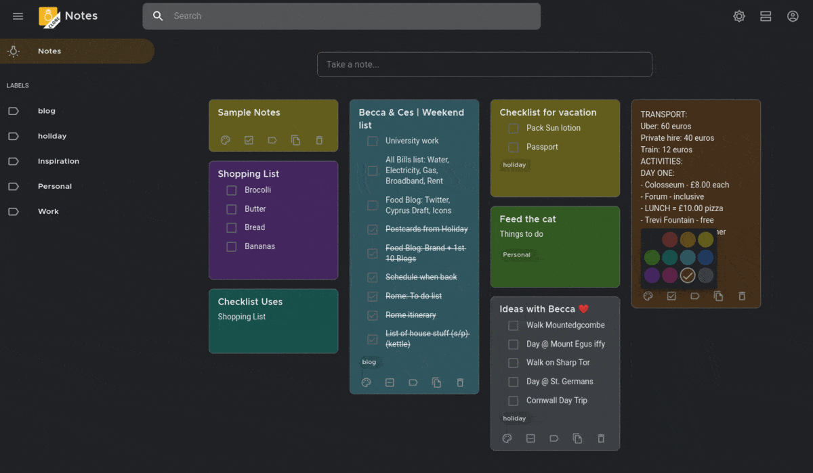

#  A Clone of Google Keep

A minimal *clone* of [Google Keep](https://keep.google.com) written in [ReactJS](https://reactjs.org/) with [Material UI Components](https://material-ui.com/). This repo contains the the frontend application, please refer [backend API](https://github.com/HaswinVidanage/keep-clone-be) written in [Golang](https://golang.org/) with [GqlGen](https://github.com/99designs/gqlgen). This project is created as a personal project with the intention of introducing complex features like sharing, collaborating notes and reminders etc in the future and focusing mostly on the backend implementation. In order for me to save time the frontend application of this project is heavily inspired by the [Google keep clone](https://github.com/anselm94/googlekeepclone.git) project and uses components from it. Please do check it out.

<div align="center">


<br/>*Light and Dark theme*

</div>

## Features

* 🔐 **Login** & 🔏 **Register** for creating a new user

* 🌈 **Colors**, 📐 **Sizes**, ❮❯ **Margins**, ❯❮ **Paddings** etc., matches exactly that of *Google Keep*'s Web App

* 📲 **Responsive Design** - Adapts all screen sizes from mobile screens up to 4k displays

* 🌚 **Dark Mode** - Dynamically change light/dark theme

* 📝 **Notes** - Create, Update, *Copy*, Delete items on the fly. Dynamically change between these 2 modes

  * 🗒 **Simple Notes** - Update/delete text in a simple text mode

  * ☑️ **Todos with Checkboxes** - will be added in the future.

* 🚥 **Colors** - Assign colors to Notes & adapts to dark/light theme

* 📜 **Display Mode** - Notes can appear in the canvas in 2 different modes

  * **List** - Displays notes as one item per row

  * **Tile** - Displays notes as tiles, and spread across the canvas

*  🏷 **Labels** - will be added in the future.

* 🔗 **Subscriptions** - When notes are created/deleted in different browser tabs, the updates are pushed from server to client. Backend subscriptions are available. Frontend integrationw will be done in the future.
* 🧑‍🤝‍🧑 **Sharing** - will be added in the future.
* 🧑‍🤝‍🧑 **Multiple collaborators** - will be added in the future.

<div align="center">

  [](https://keep-fe-clone.herokuapp.com/)

</div>


## Libraries Used

#### Frontend

* [ReactJS](https://reactjs.org) - See [`Web source`](./web/src)

  - Complete frontend JS framework

  - Follows [*React Hooks*](https://reactjs.org/docs/hooks-intro.html) pattern

* [MaterialUI](http://material-ui.com/) - See [`Login.js`](web/src/components/Login.js)

  - Follows the *new* [Material Design](https://material.io/) guidelines (known as *Material v2*)

  - Completely themed to adapt Google's version for *Keep* - See [`theme.js`](./web/src/theme.js)

  - Uses [Montserrat](https://fonts.google.com/specimen/Montserrat) font to match Google's Product Sans (*See [this Subreddit post](https://www.reddit.com/r/androiddev/comments/a6q5js/free_font_which_is_similar_to_google_product_sans/ebx6y2x?utm_source=share&utm_medium=web2x)*) and [Roboto](https://fonts.google.com/specimen/Roboto) font - See [`fonts.js`](./web/src/assets/fonts.js)

* [MaterialUI Icons](https://material-ui.com/components/material-icons/) - See [`AppBar.js`](./web/src/components/appbar/AppBar.js)

  - Uses *Outlined* Icon design

* [URQL](https://formidable.com/open-source/urql/) - See [`gql.js`](./web/src/gql.js)

  - Complete [GraphQL](https://graphql.org/) client-side JS library

  - Provides [React-hooks](https://formidable.com/open-source/urql/docs/basics/queries/) based implementations

  - Has [*Subscriptions*](https://formidable.com/open-source/urql/docs/advanced/subscriptions/) (via *Websockets*) for dynamic updates from server (to create/delete notes with different tabs open)

#### Backend 
[Project Link](https://github.com/HaswinVidanage/keep-clone-be)

* [Gqlgen](https://gqlgen.com/)
* [Wire](https://github.com/google/wire)
* [Migrate](https://github.com/golang-migrate/migrate)

## License

```
MIT License

Copyright (c) 2020 Haswin Vidanage

Permission is hereby granted, free of charge, to any person obtaining a copy
of this software and associated documentation files (the "Software"), to deal
in the Software without restriction, including without limitation the rights
to use, copy, modify, merge, publish, distribute, sublicense, and/or sell
copies of the Software, and to permit persons to whom the Software is
furnished to do so, subject to the following conditions:

The above copyright notice and this permission notice shall be included in all
copies or substantial portions of the Software.

THE SOFTWARE IS PROVIDED "AS IS", WITHOUT WARRANTY OF ANY KIND, EXPRESS OR
IMPLIED, INCLUDING BUT NOT LIMITED TO THE WARRANTIES OF MERCHANTABILITY,
FITNESS FOR A PARTICULAR PURPOSE AND NONINFRINGEMENT. IN NO EVENT SHALL THE
AUTHORS OR COPYRIGHT HOLDERS BE LIABLE FOR ANY CLAIM, DAMAGES OR OTHER
LIABILITY, WHETHER IN AN ACTION OF CONTRACT, TORT OR OTHERWISE, ARISING FROM,
OUT OF OR IN CONNECTION WITH THE SOFTWARE OR THE USE OR OTHER DEALINGS IN THE
SOFTWARE.

```
Credits
-------

The frontend application uses the work of `Merbin J Anselm` - [Google keep clone](https://github.com/anselm94/googlekeepclone.git). The [Google keep clone](https://github.com/anselm94/googlekeepclone.git) project is highly recommended if you are looking for a complete google keep clone.
